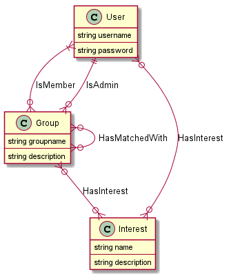

# Database

## First draft

### Tables

#### Entities

##### User
**username** | password
--- | ---
primary key |

##### Group
**groupname** | description | adminUsername
--- | --- | ---
primary key | | foreign key 👉 User

##### Interest
**interestname** | description
--- | ---
primary key | 

#### Relations

##### IsMemberOf
**username** | **groupname**
--- | ---
foreign key 👉 User | foreign key 👉 Group

##### HasMatchedWith
**groupnameA** | **groupnameB**
--- | ---
foreign key 👉 Group | foreign key 👉 Group

##### UserHasInterest
**username** | **interestname**
--- | ---
foreign key 👉 User | foreign key 👉 Interest

##### GroupHasInterest
**groupname** | **interestname**
--- | ---
foreign key 👉 Group | foreign key 👉 Interest

## Comments
- Suggestion: [UUIDs](https://www.cockroachlabs.com/blog/what-is-a-uuid/) as primary keys instead of unique names. They are [easy to generate in javascript](https://www.npmjs.com/package/uuid).
